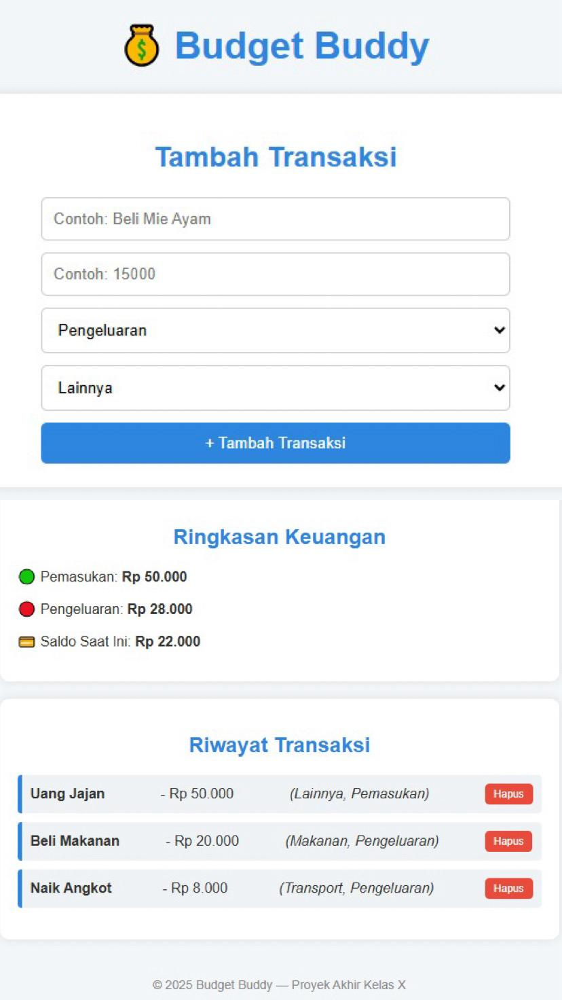

# Budget Buddy

*Budget Buddy* adalah aplikasi web sederhana untuk membantu pengguna mencatat pemasukan dan pengeluaran harian, serta memvisualisasikan kondisi keuangan mereka dengan grafik. Cocok untuk pelajar maupun siapa pun yang ingin belajar mengelola keuangan secara mandiri.

---

## Fitur Utama

- Tambah transaksi: pilih pemasukan atau pengeluaran
- Hitung saldo otomatis berdasarkan data
- Tampilkan grafik perbandingan (Pie Chart)
- Simpan data di browser dengan LocalStorage
- Export data ke file .json

---

## Tampilan Aplikasi

  
Tampilan utama Budget Buddy

---

## Cara Menjalankan

1. Buka file index.html di browser
2. Isi form transaksi: nama, jumlah, dan tipe transaksi
3. Klik *Tambah* → transaksi akan muncul di daftar
4. Grafik dan total saldo akan diperbarui otomatis

---

## Teknologi

- HTML, CSS, JavaScript
- Chart.js (grafik keuangan)
- LocalStorage (penyimpanan data lokal)

---

## Live Demo

Akses versi online-nya di sini:  
**[ https://annuralmunawarah16.github.io/budget-buddy/]( https://annuralmunawarah16.github.io/budget-buddy/)**

---

## Struktur Folder

budget-buddy/
├── index.html
├── style.css
├── script.js
├── tampilan-budget-buddy.jpeg
└── README.md

---

## Lisensi

Proyek ini open-source untuk keperluan edukasi dan pengembangan pribadi.

---